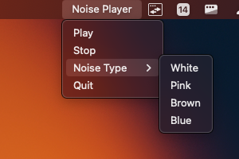

# Noise Player


Noise Player is a Python-based Mac application for generating and playing various types of noise - White, Pink, Brown, and Blue. It uses the Python libraries `rumps`, `simpleaudio`, `numpy`, `scipy`, `soundfile`, and `pydub` for creating a simple and intuitive menu bar application.

Noise Player can be useful for many purposes - masking distracting noise, helping with focus or relaxation, and even for testing audio equipment.

I highly recommend avoiding the use of white noise as it is exceedingly harsh on the ears. Pink noise is a much better alternative.


## Features

- Generate and play four types of noise:
  - White Noise
  - Pink Noise
  - Brown Noise
  - Blue Noise
- Play and stop controls
- Menu bar application, easy to access and control

## Installation

1. Clone the repository:

   ```bash
   git clone https://github.com/russellocean/noise-player.git
   cd noise-player
   ```

2. Install the required Python packages:
   ```bash
   pip install -r requirements.txt
   ```

## Usage

1. Run the script:

   ```bash
   python3 noise_player.py
   ```

2. Click on the `Noise Player` icon in the menu bar to select the type of noise and control playback.

## Contributing

Pull requests are welcome. For major changes, please open an issue first to discuss what you would like to change.

## License

[MIT](https://choosealicense.com/licenses/mit/)

## Note

This project was a test for my codebase assistant. It managed to build this entire application from the prompt "Create a simple white noise program here: <directory> It should be built in python and have an icon on the top bar in macos which can play and pause white noise. When you need to install specific libaries include them in your thoughts and I can install them for you. There is no need to test yor run the application yourself" and continually asked questions about the project until it was complete. You can find the codebase assistant here: [Codebase Assistant](https://github.com/russellocean/CodeWiseAI)
